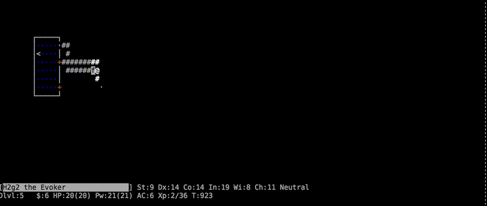

# LazyNethack

*A Screensaver for MacOS which let's you watch live nethack games*

## Installation

### Option 1: Download

1. Download from https://github.com/tessi/LazyNethack/releases
1. Unpack the LazyNethack-x.x.zip file.
1. Double-click (Open) the LazyNethack.saver file and choose to install it.
1. Open up System Preferences > Desktop and Screen Saver > Screen Saver
1. Select "LazyNethack" (It'll be at the bottom of the Screen Savers list.)

### Option 2: Build it yourself

* Clone the repository
* Open in Xcode and build the **LazyNethack** target
* In the "Products" folder, right click on **LazyNethack.saver** and choose *Open with External Editor*
* Follow the instructions on screen

### Gotchas

* It needs internet to connect to alt.org (the place where nethack people play online). If things don't load, chances are you're firewall blocks requests.
* If you want to install a new version of this screensaver, please follow these exact steps (to avoid a MacOS bug which caches the old binary):
  * remove the old version of the screensaver
  * close the settings app
  * install the new version

## Development and Contribution

Feel free to contribute by adding issues or opening pull requests. 🌷

### Architecture

The screensaver consists of two parts:

* A Swift part which hooks into the MacOS screensaver app and opens a WebView . Find the source in `Source` or open the project in XCode.
* and a web page which is opened in that WebView. Find it in `App/Ressources/index.html`. It creates a terminal (`hterm`) and opens a websocket connection to a nethack server. `gameControl.js` is responsible to orchestrate that and contains the logic how to join nethack games and when to switch to new games.

## Thanks

* **Alastair Tse** - His screen saver project [WebViewScreensaver](https://github.com/liquidx/webviewscreensaver) helped me a lot with getting a web view to run.
* **Mattias Jahnke** - His screen saver project [WorldClock](https://github.com/mattiasjahnke/WordClock) was my go to source for a nice SWIFT setup for screensavers.
* **alt.org/nethack** - A place where fellow nethack'ians play nethack online for the viewing pleasure of the world. They have their own [page]() where people can watch the game. This page heavily inspired me and my approach to base this screensaver on a WebView component.
* **The Nethack developers** - [Nethack](https://www.nethack.org/) is developed as open source. This allowed me to use the Nethack logo without inventing my own.

## License

[MIT licensed, the nethack logo is under the NETHACK GENERAL PUBLIC LICENSE](https://github.com/tessi/LazyNethack/blob/master/LICENSE)
